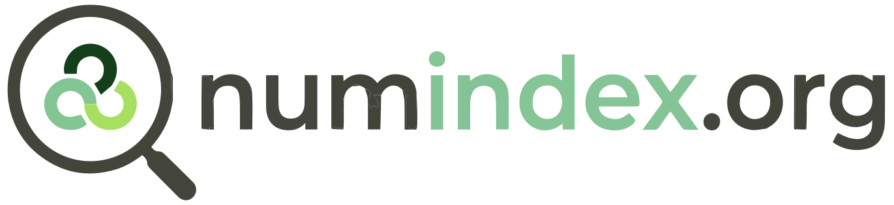

<!-- _class: title -->

### L'index open-source du numérique responsable

---

## 🚩 Le constat aujourd'hui
**Pourquoi est-ce si difficile de s'orienter ?**

* 🧩 **Fragmentation :** Les ressources sont éparpillées sur le web.
* 🏚️ **Obsolescence :** Les annuaires existants sont rarement mis à jour.
* 🔍 **Invisibilité :** Difficile de trouver des outils via les moteurs classiques.
* 🎯 **Ciblage restreint :** Les ressources actuelles se limitent souvent à une seule catégorie (uniquement outils, ou uniquement articles...).
* ⛔ **Fermeture :** Impossible ou complexe de proposer des modifications.

---

## 🎯 La Mission
**Accompagner tout l'écosystème**

* **Pour les débutants :** Un point d'entrée simple pour découvrir les **ressources essentielles** du Numérique Responsable (NR).
* **Pour les experts :** Un outil centralisant les **prochains événements** et les **derniers contenus vérifiés**.
* **Objectif :** Créer un commun numérique, centralisé, filtrable et toujours à jour.

---

## 📂 Les 4 Piliers
**Une taxonomie claire et structurée :**

* 🏢 **Acteurs :** Entreprises, associations et experts du secteur.
* 🛠️ **Outils :** Logiciels, référentiels, formations et **ateliers**.
* 📅 **Événements :** Conférences, **meetups** et salons dédiés.
* 📚 **Contenus :** Publications, rapports, podcasts et livres.

---

## ✨ Fonctionnalités Clés
**Plus qu'un simple annuaire :**

* 🗺️ **Carte Interactive :** Localisation des acteurs et événements.
* ⭐ **Favoris :** Espace personnel pour sauvegarder ses ressources.
* 📥 **Export Intelligent :** Export au format "Favoris Navigateur" (HTML).
* 📅 **Abonnement ICS :** Flux calendrier pour ne rater aucun événement.

---

## 🍃 L'Engagement de Sobriété
**Pratiquer ce que l'on prône :**

* **Écoconception :** Images AVIF (<20 Ko), pas de JS superflu.
* **Poids plume :** Nous nous efforçons de garder chaque page **< 1 Mo**.
* **Performance :** Score EcoIndex ≥ C et Lighthouse ≥ 85.
* **Maintenance :** Nettoyage auto des médias et optimisation continue.

---

## 🇪🇺 Souveraineté & Technique
**Une stack robuste et éthique :**

* 🌍 **Domaine :** Géré par **Infomaniak** (Hébergeur éco-responsable & indépendant).
* ⚡ **Performance :** Configuration **Cloudflare Smart Routing**.
* 🏗️ **Techno :** Astro (Hybrid SSR/Static) pour une rapidité maximale.
* 🔒 **Souveraineté :** Données hébergées en UE (**Supabase Paris**).

---

## 🤝 Comment Contribuer ?
**Un projet porté par la communauté**

* **Créer un compte :** Inscription rapide pour accéder aux fonctions contributives.
* **Proposer :** Ajout, **modification** ou **suppression** de ressources via des formulaires simples.
* **Critères :** Une charte de qualité stricte (NR au cœur de l'activité).
* **Modération :** Un workflow transparent de vérification par les administrateurs.
* **Open Source :** Code sous licence GNU GPL v3.

---

## 🗺️ Plan de route
**Les prochaines étapes du projet**

* **Gouvernance :** Création d'un collectif avec différents rôles et désignation d'administrateurs pour la validation.
* **Synchronisation :** Mise en place d'une réunion récurrente et d'un outil d'échange d'informations.
* **Diffusion :** Stratégie de communication (Webinaires, Slack, LinkedIn, etc.).
* **Évolution :** Recueil des propositions de fonctionnalités et développement continu du site.

---

## 🚀 Conclusion & Contact
**Rejoignez le mouvement !**

* 🌐 **Site :** [numindex.org](https://numindex.org)
* 💻 **GitHub :** [github.com/csauge/numindex](https://github.com/csauge/numindex)
* 📧 **Contact :** contact@numindex.org
